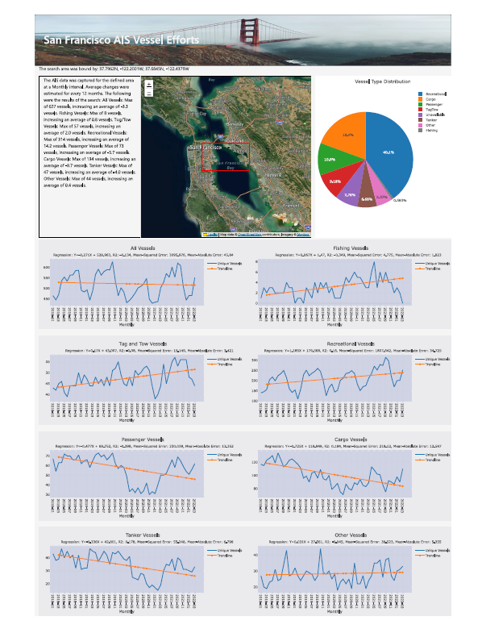

# AIS Vessel Efforts Project

## Overview 

### What Topic We Selected

The topic we selected is seeing which types of maritime vessels use various waterways. We hope to see current usage by filtering the data we obtain, and predict future usage using supervised machine learning. Our scope right now is the San Franscio Bay Area, but this code can be easily tweaked to examine other areas. The scope of this project will use data from the past five years, ranging from 2017-2021, analyze it, then predict the next five years with our model.

### Reason We Selected the Topic

We believe this is an interesting topic with lots of practical applications. By viewing the type of traffic in specific waterways, we can see exactly what kinds of permits need to be given out for ships to travel. This will lead to a more streamlined process of distributing these permits, especially for event permits that people will need to acquire in advance. It can also help see if current channels are adequate to handle the flow and type of traffic in them, as well as determine a need for new channels. Lastly, it can help track enviromental impact for each channel, as one can calculate the emissions output from the amount of ships going through each channel.

### Description of the Source of Data

We are taking our data directly from https://marinecadastre.gov/ais/. The data we are pulling from this site is called Automatic Information System (AIS), and it is a broadcast of the location and description of maritime vessels. This site in particular contains daily CSV files that contains daily activity in US waters. We are going to take data ranging back over the past five years, and perform an ETL on them to reduce them down to the following columns:

* MMSI
* DateTime
* Latitude
* Longitude
* VesselType

### Questions We Hope to Answer

There are two main questions we hope to answer with this project. They are:

1) What are the different types of vessels operating in the selected area? As a followup to this, we are going to break down the percentage of each type of vessel that uses the various waterways in the area we're examining.

2) What does the potential growth in traffic along the waterways look like in the future, and can we use this to plan changes in the chosen waterways?

### What the Communication Protocols Are

We plan to meet over Zoom during class on Tuesday and Thursday, and a catchup meeting on Sundays. There will also be daily communication through Slack as well as individual meetings when needed.

### Preprocessing

The ETL process used a python script that pulled the data from the web using BeautifulSoup, and then filter it down to the defined data extent for the San Francisco region, and remove/fill in missing data. This data was output as daily csv files. Next, the data was pushed to the postgreSQL database, which was delayed due to the throttling in AWS's free tier. 

### Machine Learning Applications

This project utilized Linear Regression and LSTM machine learning models on the data. The linear regression outputs the average change over time based on the historical data, which can be used to estimate the expected change in the near-future. The LSTM model attempts to find an accurate prediciton based on the historical data.

Data was split into test, train sets using sklearn's test_train_split. The Linear Regression used random sampling for the test-train data, while the LSTM used a set split at 75% of the length of the dataset.

Scaling was used only with the LSTM model.

The main advantages of the linear regression model were found when interperating, and training our data. Since we were looking at every boat type independantly, all the data we worked with was linearly seperable. Having linearly seperable data made it easy for us to interperate and train our data using sklearn and create visualizations. Overall, Linear Regression is an effective option for us to see trends and make predictions. 
However, we did find there are some limitations with our linear regression model. It is quite sensitive to the outliers, which affected the slope of the boat types that experienced seasonality. Furthermore, the model was not consistently accurate for every model. Again, boat types that experienced seasonality had more of a curve than a linear trend which would affect the accuracy score. Although the linear regression model is easy to implement, it was not the best model to use for certain types of boats. 

### Database setup

PostgreSQL was used as the database for this project, and was linked to AWS RDS cloud database services. This database consists of a single table spanning 4+ years of AIS data from 2018-early 2022. This data is queried by the flask application to output a summary of each vessel-type code per chosen time interval. This output is used to run the models and plot the resulting data.

Databased consists of more than 234,721,320 rows.

### The dashboard

The dashboard is integrated into the front-end. It will automatically redirect when the search completes and show the search area, the summary of vessels, the percentage breakdown, and each vessel-type plotted over time and the linear regression results.

The LSTM model has a separate dashboard that can be redirected to using the navigation bar at the top of the screen.

